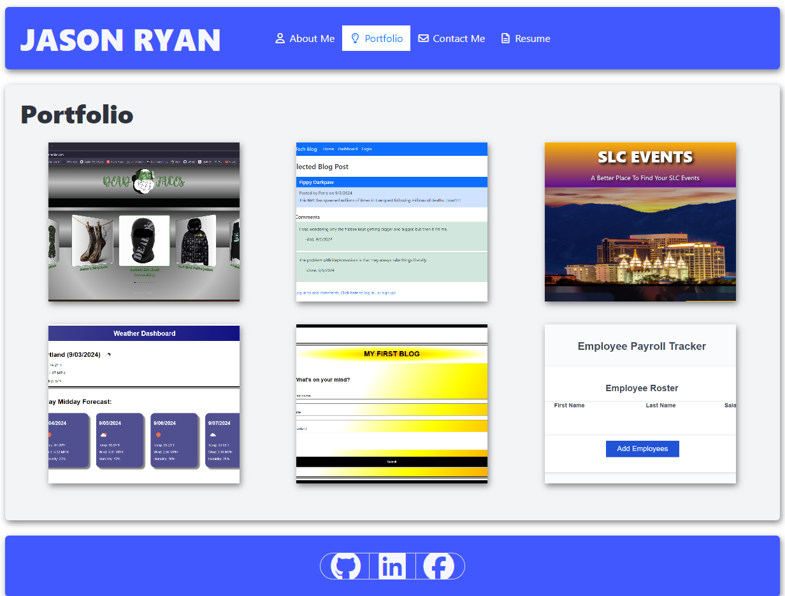

# Jason Ryan: My Portfolio
  

  

## Description
  

A React portfolio of work samples that a potential employer can view so they can assess whether I am a good candidate for an open position.
  

## Table of Contents
  

- [Installation](#installation)
  
- [Usage](#usage)
  
- [License](#license)
  
- [Contributing](#contributing)
  
- [Tests](#tests)
  
- [Questions](#questions)
  

## Installation
  

This application can be installed by deploying the repository to a hosting site.  A version of this application is currently deployed on Netlify.  A user wishing to utilize this application immediately without installing the application first can do so by visiting https://jryanportfolio.netlify.app/.
  

## Usage
  

This application is a simple viewing application so a prospective employer may view my work when considering me for possible employment.

***NOTE***: All personal information found within this application or any applications to which it is linked may only be used for purposes of employment and education.  This information shall not be used for any other purpose.

A user may navigate through the links located at the top of the page to view a quick summary about me, view applications that I have created, contact me, and view my resume and coding skills.  This information will appear in the center section of the page as the user clicks the links.

A user may also use the links at the bottom of the page to view my GitHub, LinkedIn and Facebook profiles.  These will be opened in a new tab.
  

## License
  

This application is operating under the following license: **MIT License**.  
  

Further information regarding this license, to include the required notice, can be read by navigating to the following link: https://opensource.org/licenses/MIT.
  

## Contributing
  

Anyone wishing to contribute to this project can do so by contacting me via the information located in the "Questions" section below.
  

## Tests
  

There are no testing examples provided for this project at this time.
  

## Questions
  

Any questions regarding this project can be answered by contacting me through my GitHub profile or by email:
  
GitHub Profile: https://github.com/orian42
  
email: orian42@gmail.com
